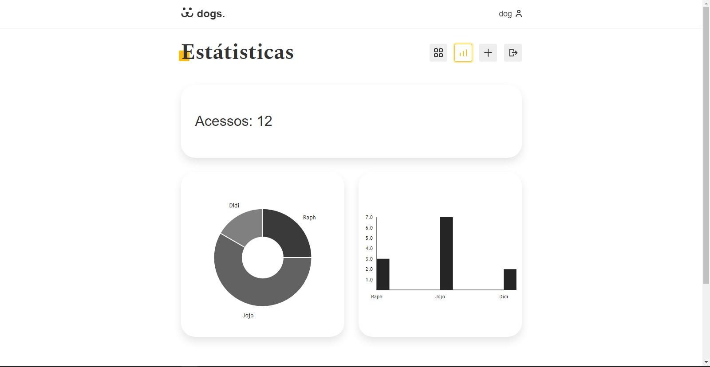
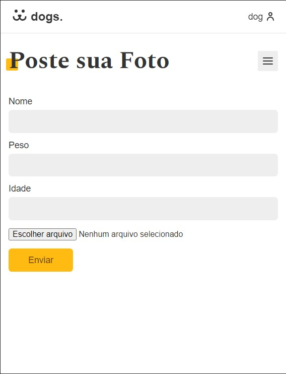

# dogs. - Social Media for dogs.
A social-media for dogs, created during Origamid React classes.

<h2>Hello ❕</h2>
<h3>➡️This project was developed using <strong>HTML5, CSS & React</strong> 🛠️</h3>

➡️Developed during Origamid React classes.

<h3>Desktop 🖥️</h3>
</img>
 
</img>
 
</img>
 
</img>
 
</img>
 
</img>
 
</img>
 
</img>
 
</img>

<h3>Mobile 📱</h3>

</img>
 
</img>
 
</img>
 
</img>
 
</img>
 
</img>
 
</img>
 
</img>
 

<h3>Overview ⮯</h3>

 There was applied here my knownledges in HTML5, CSS & React, for and a better visual experience for the final user.

<h3>The path of the project was to clearly apply the most used and up-to-date concepts used in this lib, using most part of the resources that are avaliable, creating custom and reactive components, custom hooks, using open tools as <strong>Babel & Webpack</strong> to manage and compilate all code into modern JavaScript,<strong>React Router DOM</strong>, to gerenciate routes for the aplication, a custom library with graph designs called <strong>Victory</strong>.</h3>

The main idea behind the project has to create a social-media for dogs, that you can, post, comment, create a on user-profile, visit other users profile, check the stats of your own profile, with a flow similar to Instagram.

Was used a external <strong>JSON REST API in Wordpress</strong> to serve the data for the front-end, consuming, updating, deleting and posting information into the App with custom endpoints, that you can register into and navigate freely.

Concepts were also used to improve UI/UX, ensuring the responsiveness and speed of the application 💻🖥️📱

<h3>The project has concepts like:</h3>
<ul>
  <li>Fetch for external API's in JSON format 🔧</li>
  <li>Infinite Scroll in homepage ⬇</li>
  <li>Log-in system, with password-reset, auto-login and token validation ⬇</li>
  <li>Profile maneagement ⬇</li>
  <li>Post with a modal component and integrated comment list ⬇</li>
  <li>Menu Mobile 📱<small>["hamburguer"]</small></li>
  <li>Organics/Dinamics animations 🧑‍💻</li>
</ul>
<h3>How to run ⮯</h3>

You just need to have a VSCODE copy installed, you can open the main folder, go to the terminal and do a "npm start" for the development ambient, the build version isn't hosted, but is ready to be online!

 

ATT: 10/02/2021 - 👨‍💻 João Vítor Carvalho

<em>'This project has no commercial purposes, it was carried out only for the application of my studies'📚</em>

<strong>----João Vítor Carvalho 👨‍💻 ---</strong>
